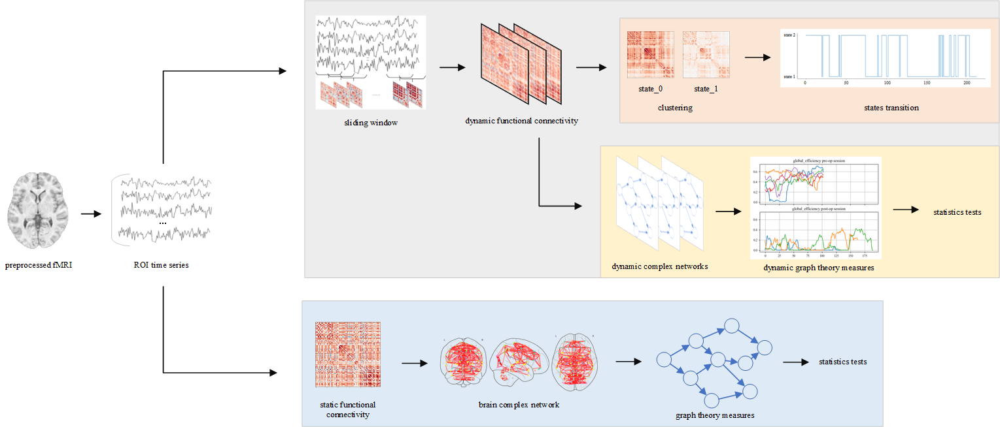
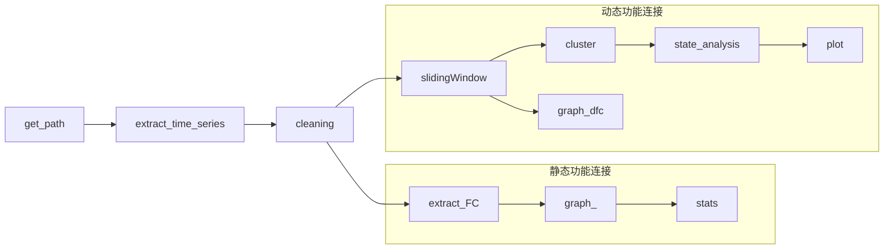

# es-fMRI

[English](./README_EN.md) | 中文

[TOC]  

研究使用了动态功能连接聚类和图论等方法对电刺激治疗癫痫fMRI数据集进行分析

使用公开数据集：[Human es-fMRI Resource](https://github.com/wiheto/esfmri_data_descriptor)
数据集介绍: [https://doi.org/10.1101/2020.05.18.102657](https://doi.org/10.1101/2020.05.18.102657)
数据集下载: [https://openneuro.org/datasets/ds002799/](https://openneuro.org/datasets/ds002799/)

## 笔记

公开数据集已经进行过预处理，可以直接使用。
esfmri.py 包含一些会反复用到的函数
graph.py 包含构建复杂网络并计算图论参数的函数

### 流程

研究整体流程

#### 代码流程

1. 先分析数据集，生成json文件，保存后面需要读取的文件位置。
2. 使用nilearn模块，选择合适的模板，提取时间序列并保存为pickle文件。
3. 清理长度过短的数据

#### 动态功能连接

 -> slidingWindow
使用滑动窗口法拆分时间序列并按顺序保存。同时计算时间序列间的皮尔逊相关性作为动态功能连接。

 -> cluster -> plot
聚类并绘制状态变化。

 -> graph_dfc
使用图论分析复杂网络中参数变化过程，并进行统计学分析

#### 静态功能连接

 -> extract_FC -> graph -> stats
计算时间序列间的皮尔逊相关性作为功能连接。
对功能连接矩阵进行二值化，将其作为图的邻接矩阵，使用networkx模块建立复杂网络，计算图论的各种评价参数。
使用统计学方法评估电刺激前后参数变化是否存在明显差异。
