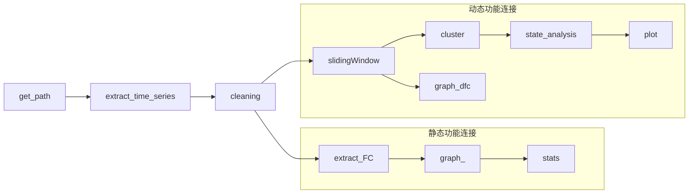

# es-fMRI

English | [中文](./README.md)

[TOC]  

Use clustering and graph theory to study functional connectivity extracted from electrical stimulation fMRI of epilepsy patients.

This study used datasets: [Human es-fMRI Resource](https://github.com/wiheto/esfmri_data_descriptor)
datasets article: [https://doi.org/10.1101/2020.05.18.102657](https://doi.org/10.1101/2020.05.18.102657)
download datasets: [https://openneuro.org/datasets/ds002799/](https://openneuro.org/datasets/ds002799/)

## Note

The used open datasets have been preprocessed.
there are several common functions in the file esfmri.py

### Workflow

workflow of the study

#### process of the codes

